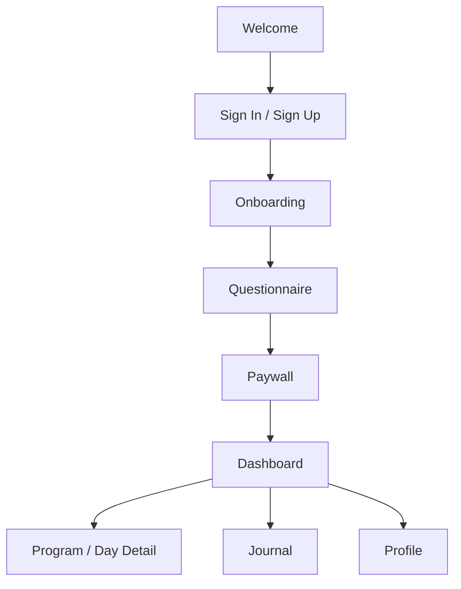

# Recovery Compass UI/UX Brief

> **Goal:** make the app feel more calm, premium, and worth the subscription price, while keeping the flow practical to ship.

## Product

Recovery Compass is a guided recovery and wellness app. It helps users sign in, complete a questionnaire, get a recommended program, subscribe if needed, and then use the app for daily recovery, journaling, and progress tracking.

## What We Want

We want a UX/UI pass that improves:

- first impression
- onboarding clarity
- paywall trust and value
- dashboard usefulness
- program experience
- audio behavior confidence

The app should feel supportive, not clinical, and definitely not generic.

## Audience

People using the app for recovery and habit change, including:

- quit smoking
- sleep support
- stress recovery
- general wellness support

The interface should work well for users who may be distracted, stressed, or new to the app.

## Current Flow

### Important rule

The app currently supports one active program at a time in the main experience. For the smoking path, the paywall may show both:

- 6-Day Reset
- 90-Day Quit Smoking

## Screens To Focus On

- Welcome
- Sign In / Sign Up
- Questionnaire / Personalization
- Paywall
- Dashboard
- Program / Day Detail
- Journal
- Profile / Settings

## Current Issues

Some parts of the app still feel less polished than they should:

- route transitions can feel abrupt
- paywall behavior needs to feel more intentional
- some screens can feel blank if access is not confirmed yet
- audio should stop cleanly when users leave a program
- the app should always make the next step obvious

## Design Direction

We want the app to feel:

- calm
- trustworthy
- supportive
- clean
- emotionally steady
- grounded in the dark green brand

### Value perception

This is the biggest concern right now. The app needs to feel worth the money a user is spending.

That means the experience should feel:

- more premium
- more complete
- more intentional
- more useful from the first few screens

The designer should think about value perception as a UX problem, not just a visual one. If the app feels empty or vague, users will not feel the subscription is justified.

## Constraints

- keep changes realistic to ship
- avoid a full redesign that changes the whole architecture
- keep iOS and Android compatible
- keep the app clear enough for store review and real users
- avoid hidden or clever navigation

## Success Looks Like

We’ll know this is working if:

1. the app is easier to understand on first use
2. the questionnaire to paywall flow feels intentional
3. the dashboard and program experience feel coherent
4. the app feels emotionally supportive without being generic
5. the user feels the subscription is worth it

## Future Roadmap

This is not for the first pass, but it gives context for where the product is going.

### Near term

| Feature | Why it matters | Design note |
| --- | --- | --- |
| Calm / Ground Me | Gives users an immediate reset when they feel overwhelmed. | Should feel fast, soothing, and easy to reach. |
| Better completion flow | Helps users feel progress and closure. | Consider a completed state and next-step suggestion. |
| Notifications / reminders | Supports habit formation. | Should feel gentle, not nagging. |

### Later

| Feature | Why it matters | Design note |
| --- | --- | --- |
| In-app community | Adds belonging and peer support. | Must feel safe and moderated. |
| Multi-program support | Useful if users move between programs. | Needs very clear active-program rules. |
| Next-program recommendations | Creates a natural next step after completion. | Should feel supportive, not sales-first. |

## What We’d Like From You

Please share:

- UX notes on the current flow
- wireframes or mockups for key screens
- recommendations for hierarchy, spacing, and interaction behavior
- anything that should be simplified or removed

## Short Version

Recovery Compass is a guided recovery and wellness app. We need a focused UX/UI pass on the welcome flow, questionnaire, paywall, dashboard, program screens, and journal. The goal is to make the app feel calmer, clearer, and more worth the subscription price while keeping the experience practical to build.

